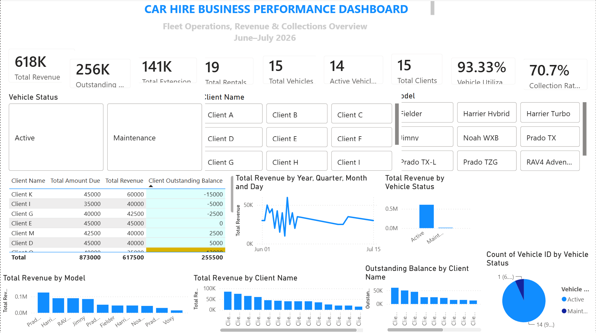

# Car Hire Business Performance Dashboard

## Project Overview

This project presents an interactive **Power BI dashboard designed to analyze the operational and financial performance of a car hire business**.

The dashboard brings together information on vehicle inventory, client bookings, payments, rental extensions, and fleet utilization to provide a centralized view of business performance and support data-driven decision-making.

---

## Business Problem

Car hire businesses need to monitor fleet availability, rental activity, revenue generation, outstanding payments, and vehicle utilization. When this information is maintained across separate records, it can be difficult to identify performance trends and operational issues quickly.

This project addresses that challenge by transforming rental business data into an interactive Power BI reporting solution that allows users to monitor key performance indicators and explore business performance from different perspectives.

---

## Project Objectives

The dashboard was developed to:

* Monitor overall fleet performance
* Track rental activity and bookings
* Analyze revenue generated from rentals
* Monitor outstanding customer balances and payment collection
* Track revenue generated through rental extensions
* Evaluate fleet utilization
* Identify active and available vehicles
* Support operational and financial decision-making

---

## Key Dashboard Metrics

The dashboard provides visibility into key indicators including:

* **Total Revenue**
* **Outstanding Balance**
* **Extension Revenue**
* **Total Rentals**
* **Fleet Size**
* **Active Fleet**
* **Total Clients**
* **Fleet Utilization**
* **Collection Rate**

---

## Dashboard Features

### Fleet Management

Provides an overview of the vehicle fleet and its utilization, helping identify vehicles that are active, available, or underutilized.

### Rental & Booking Analysis

Tracks rental activity and provides visibility into booking patterns and overall rental performance.

### Revenue Analysis

Analyzes rental revenue and extension revenue to provide a clearer picture of business income.

### Payment Monitoring

Tracks amounts collected and outstanding balances, helping management monitor payment performance and collection rates.

### Extension Tracking

Captures rental extensions and associated revenue to evaluate their contribution to overall business performance.

### Interactive Reporting

Users can interact with dashboard visuals and filters to explore different aspects of fleet, rental, revenue, and customer performance.

---

## Tools & Technologies

* **Microsoft Power BI Desktop**
* **Power Query**
* **DAX**
* **Data Modeling**
* **Data Visualization**

---

## Data Analysis & Modeling

The project involved structuring and analyzing business data related to:

* Vehicles
* Clients
* Rentals
* Payments
* Rental Extensions
* Vehicle Inspections

The data was transformed and modeled in Power BI to support interactive reporting and KPI analysis.

---

## Project Files

* [`Car_Hire_Dashboard_Final.pbix`](Car_Hire_Dashboard_Final.pbix) — Power BI Desktop project file
* [`dashboard.png`](dashboard.png) — Dashboard preview image

---

## Skills Demonstrated

This project demonstrates practical application of:

* Data cleaning and transformation
* Data modeling
* DAX calculations
* KPI development
* Business performance analysis
* Dashboard design
* Data visualization
* Interactive reporting
* Translating business requirements into analytical solutions

---

## Outcome

The completed dashboard provides a centralized reporting solution for monitoring car hire business performance and enables management to move from manually reviewing operational records toward a more structured, visual, and data-driven approach to decision-making.
